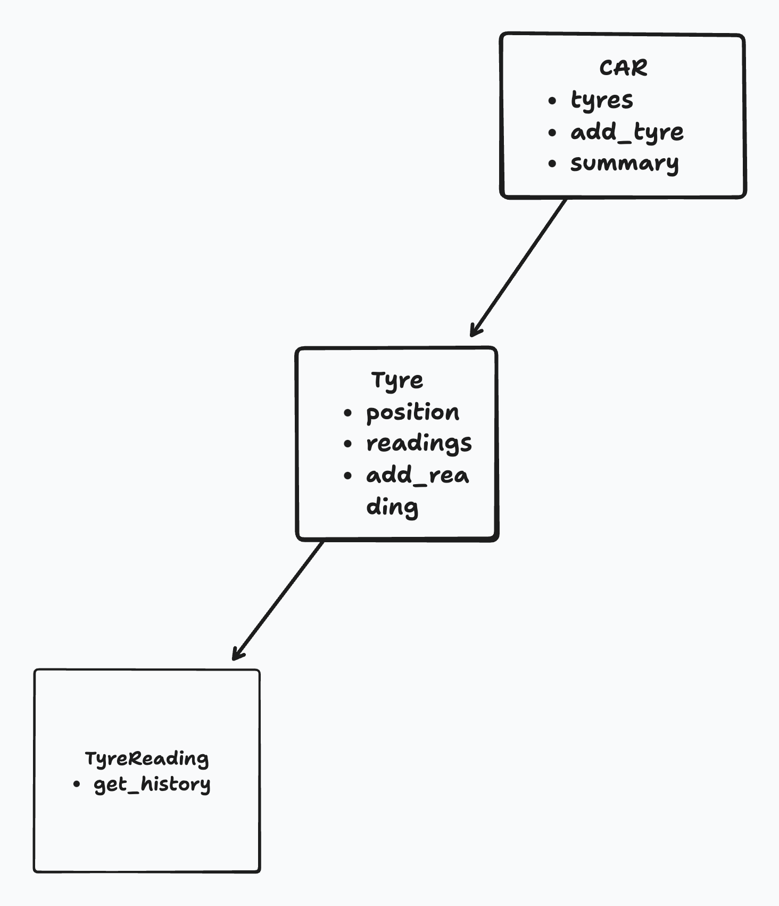

# {{PROBLEM}} Multi-Class Planned Design Recipe

## 1. Describe the Problem

As a car owner
So that I can keep a record of details about my tyres
I want to keep track of the tyres individually, by their position on my car

As a car owner
So that I have the two important pieces of data for a tyre
I want to be able to record both tyre pressure and tyre tread depth

As a car owner
So that I have a history of tyre readings
I want to be able to keep a record of historical readings, when those were, as well as current readings

As a car owner
So that I can see the details of my car at a glance
I want to list the tyres' positions, latest readings and when those were


## 2. Design the Class System

_Consider diagramming out the classes and their relationships. Take care to
focus on the details you see as important, not everything. The diagram below
uses asciiflow.com but you could also use excalidraw.com, draw.io, or miro.com_


Objective:

We will create a system with three main classes:

-Car: represents car and contains tyres
-Tyre: represents a tyre with its readings
-TyreReading: represents a single reading (pressure, tread depth and date)


```

car: tyres // add_tyre() // summary()
      vvv
     tyre: position // readings // add_reading() // latest_reading( TyreReading ) // get_history()

```

_Also design the interface of each class in more detail._

```python
class TyreReading:

    def __init__(self, pressure, tread_depth, date):
        self._pressure = None
        self._tread_depth = None
        self._date = None


    # FYI
    def __repr__(self):
        return  f"{self.date()} - Pressure: {self.pressure} bar - Tread depth: {self._tread_depth} mm"

class Tyre:
    
    def __init__(self, position):
        # self.position = position 
        # self.readings = [] <---- use to get the last element, which should be the latest reading
        # self.tyre_reading = TyreReading()

    def add_reading(self, pressure, tread_depth, reading_date):
        # Side effects:
        #   Updates instance of TyreReading with the passed arguments
        # Logic: validating that reading_date is in the right format
        # Returns:
        #   None

    def get_reading_history(self):
        # Returns:
        #   all the tyre_records in self.readings
        #   return self.readings

    def latest_reading(self):
        # Returns:
        #   the latest reading in self.readings ([-1])


class Car:
    # User-facing properties:
    #   title: string
    #   artist: string

    def __init__(self):
        # Parameters:
        self._tyres = []

    def add_tyre(self, position):
        # Returns:
        #   None
        # Side effect:
        #   Adds tyre to self._tyres
        pass # No code here yet

    def get_tyre(self, position):
        # Returns:
            #   Returns requested tyre
        # Side effect:
            #   None
        pass # No code here yet

    def get_summary(self):
        # Returns:
            #   Returns list with all the tyre records
            #   If no tyre records, returns error message
        # Side effect:
            #   None
        pass # No code here yet

```



## 3. Create Examples as Integration Tests

_Create examples of the classes being used together in different situations and
combinations that reflect the ways in which the system will be used._

```python
# EXAMPLE

"""
Given a TyreReading
When we add two tracks
We see those tracks reflected in the tracks list
"""


## 4. Create Examples as Unit Tests

_Create examples, where appropriate, of the behaviour of each relevant class at
a more granular level of detail._

```python
# EXAMPLE

"""
Given a track with a title and an artist
We see the title reflected in the title property
"""
track = Track("Carte Blanche", "Veracocha")
track.title # => "Carte Blanche"
```

_Encode each example as a test. You can add to the above list as you go._

## 5. Implement the Behaviour

_After each test you write, follow the test-driving process of red, green,
refactor to implement the behaviour._
